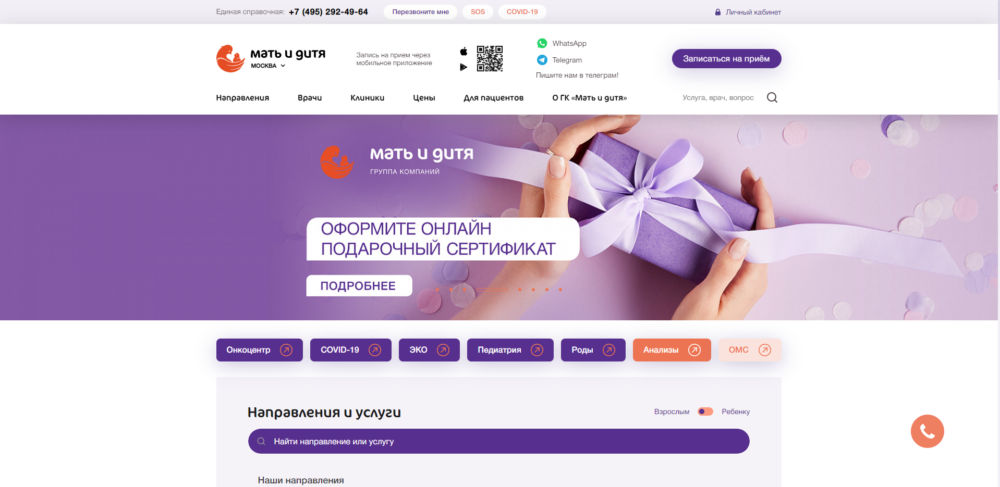
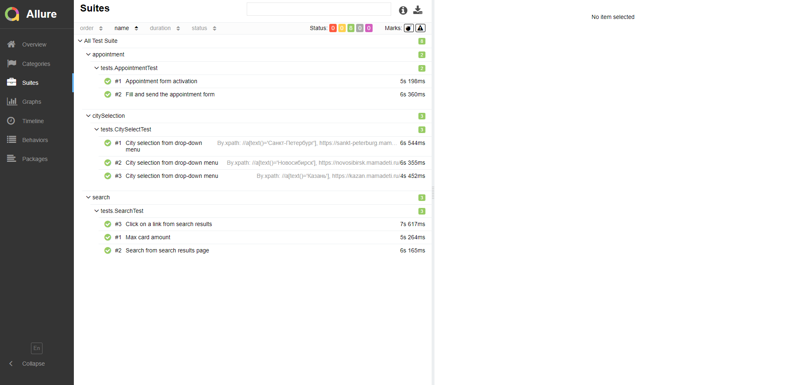

# Авто-тесты для web-приложения

Это мой учебный проект по автоматизации тестирования. Написал его для получения практических навыков, поскольку изучаю автоматизацию тестирования самостоятельно.

В качестве тестового стенда был выбран сайт https://mamadeti.ru/. На мой взгляд, он достаточно современный, неплохо выглядит и хорошо подходит для практики.
___
## Основные фичи
* Паттерн проектирования Page Object
* Для автоматической совместимости вебдрайвера и браузера использован инструмент WebDriverManager
* В проекте с помощью констант предусмотрена предварительная настройка:
    * Выбор любого из трех популярных браузеров:
        * Chrome
        * Firefox
        * Edge
    * Времени явных и неявных ожиданий
    * Удаление cookies и session storage после теста
* В проекте реализован тест-сьют, включающий в себя 8 тест-кейсов. Описание тест-кейсов: https://github.com/asbuyanov/mama-deti-web-autotests/blob/main/mama-deti-test-cases.txt
___
## Технологии
Язык программирования:
* Java

Библиотека для управления браузером:
* Selenium WebDriver

Фреймворк для управления тестами:
* TestNG

Система сборки и управления проектом:
* Apache Maven

Инструмент для создания отчетов:
* Allure
___
## Дополнительно
* Вид главной страницы https://mamadeti.ru/

* Скришот отчета о тест-ране в Allure

